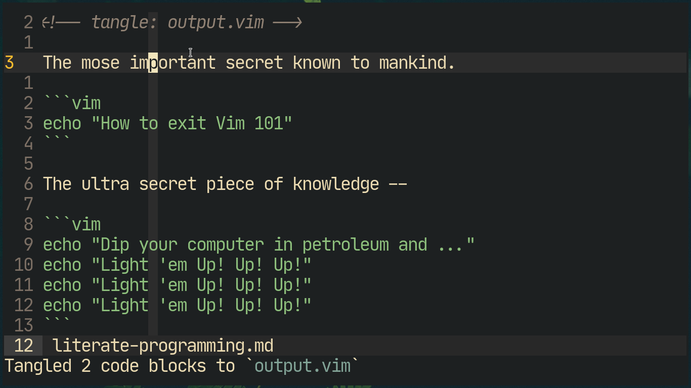
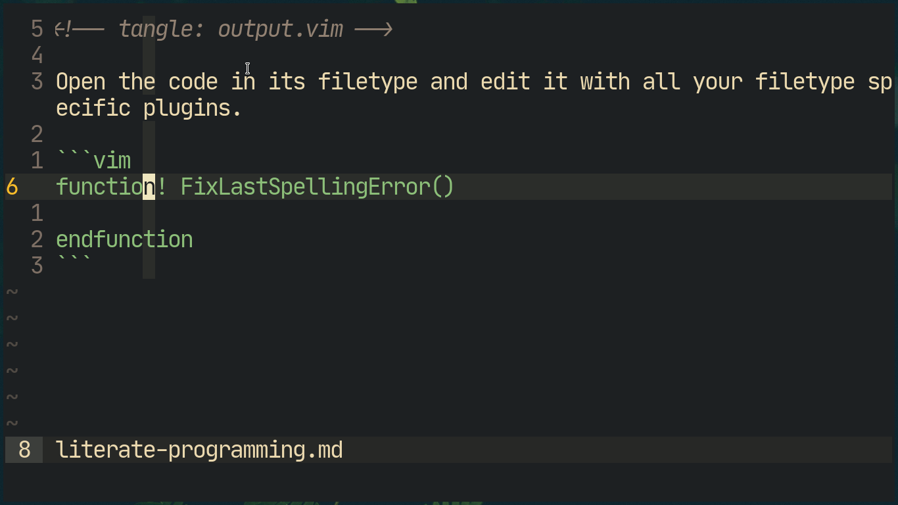
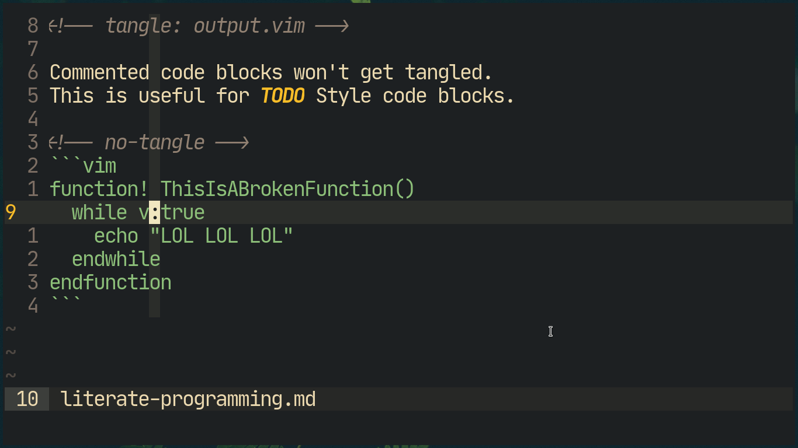

# Neovim Literate
This is the result of me going green-eyed over Org-mode's literate programming features over in Bloa.. I mean Emacsland.\
***Note***: This is merely a pale shadow of the features offered in Org Mode. I know how insanely powerful it is and I won't degrade it by pretending my cobbled-up plugin is even remotely capable of replacing it, so no *yelling* at me!

# Installation
Using Neovim's builtin package system.
```sh
git clone https://github.com/shoumodip/nvim-literate ~/.config/nvim/pack/plugins/start/nvim-literate
```

You can also use any package manager of your choice.

# File Detection
- Works on Markdown files.

# Features
## Tangle
Take the source code present in all the code blocks in the markdown files and write it to a destination file.
```
<!-- tangle: OUTPUTFILE -->
```
Place this declaration on the **first line** of the markdown file where `OUTPUTFILE` is the file where the code blocks will be tangled to.

`<Leader>ee` Tangle the code blocks.

***IMPORTANT***: The beginning of each code block **must** have a filetype declared in typical markdown syntax **without** any parenthesis. as shown in the image below otherwise they won't be tangled.



## Code Edit Window
`<Leader>es` Toggle the Source Code editing window in *Normal Mode*.

Open the code present in the code block in a new tab in the filetype of the code block. If the source code is currently being edited, close it and replace the old piece of code with the new code.

***IMPORTANT***: The beginning of the code block **must** have a filetype declared in typical markdown syntax **without** any parenthesis. as shown in the image below.



## Code Block Comments
`<Leader>ec` Comment or uncomment a code block.

A commented code block is marked with
```
<!-- no-tangle -->
```
at its top and it will not get tangled to the output file.

***IMPORTANT***: The beginning of the code block **must** have a filetype declared in typical markdown syntax **without** any parenthesis. as shown in the image below otherwise commenting won't work. Also the file must be marked for tangling (see the section `Tangle`) above).



## Important Mentions
Every code block you wish to tangle, filetype-edit and comment on *must* have at least one line in them, even an empty line will work. This is done to ensure that the bottom of the code block does not get overwritten. Better yet use the default abbreviation `<s` to create a code block.

# License
MIT
